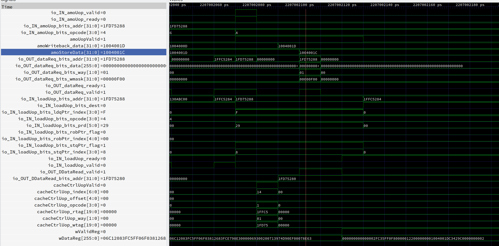

## 原子指令与PTW bug
amo指令，和所有lockInst，一样，会等到ROB，storeQueue， storeBuffer完全清空后进入后端，地址翻译后进入amoUnit
amoOp进入amoUnit后，会阻止PTW访问LSU端口，但是如果PTW在原子指令前一个周期进入LSU，且
   1. 和AMO index相同
   2. 未命中，替换的way与amo操作的way相同
由于amo写延迟较长，导致MSHR读Cache时恰好是AMO 写cache 时。
由于采用了双端口Cache，MSHR读口与LSU写口不相同，且之间没有bypass，导致amo指令实际上没有执行，bug！
发现条件：ITLB DTLB 条目设为1，在linux启动时发现。

由于没有bypass，当cache Miss，LSU写tag时会阻止后续指令进入。但是这是时序上的关键路径。
writeTag延迟一拍后，后一个指令有可能命中一个会被替换的cache line，如果这时候是常规写，暂时不会出问题：cacheUop -> MSHR -> read cache有一段时间，MSHR能读到写数据。
但是对amo这种延迟长的，会出问题。

## DCache Flush Bug

LSU中内置了一个用于清空cache的状态机。

这是bug修复前vs修复后
！[flush-cacheuop](flush-cacheuop.png)

在修复前，它通过cacheUopReq发起请求，然而，因为过度严格的cacheUop/MSHR conflict判定（false positive），可能会导致一个cacheUopReq被拒绝处理。而flush状态机中没有对canServeCacheUop为false时进行处理，导致一个cacheUopReq没有被刷下去，信息丢失。

修复后：直接override cacheCtrlUop，保证请求发起成功。

## 可能的bug
### Cache LSU
Cache VIPT访问。发起的aguVirtualIndex是否会与amo冲突？
aguLoadUop没有出现（TLB miss）时的行为，aguLoadUop与aguVirtualIndex不匹配的行为。

AGU 什么时候发起aguVirtualIndex？需要只在常规load时。

amo storeQueue/Buffer 排空判断

LSU pipeline 读tag到修改的过程中，当前cacheline是否有效（前序cacheUop）

LSU AMO与PTW 冲突

CacheController loadResultForward -> loadResultBuffer

CacheController 一个MSHR的aw发起后，w通道必须是那个MSHR的，保证正确的ordering

LSU flush清空常规pipeline时，不能清空PTW

UncachedLSU flush不清空store，只清空load。

loadResultBuffer空间判断。判断是否能放进loadResultBuffer和实际发起请求有一个周期的延迟，所以需要`loadResultBuffer.io.OUT_numEmpty > 1.U`。

cacheHit 判断

### StoreQueue/Buffer

StoreQueue 判断空的信号是否能打拍？

### lockBackend指令

rename阶段 backendEmpty 是否要求storeQueue/Buffer空

### 中断

中断处理时间点（当前：检测到中断pending，则当前第一条指令附带一个中断标记，flagHandler中，判断是否真的有中断pending，如没有，则重新跳转到当前PC重新取指执行）

### Instruction Decode

几个特殊指令的优先级

比如illegal inst应该override前面所有